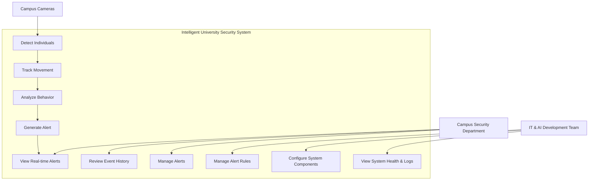

```mermaid
graph TD
    subgraph Intelligent University Security System
        UC1[View Real-time Alerts]
        UC2[Review Event History]
        UC3[Manage Alerts]
        UC4[Manage Alert Rules]
        UC5[Configure System Components]
        UC6[View System Health & Logs]
        UC7[Detect Individuals]
        UC8[Track Movement]
        UC9[Analyze Behavior]
        UC10[Generate Alert]
    end

    %% Actor to Use Case Connections
    actor1[Campus Security Department]
    actor2[IT & AI Development Team]
    actor3[Campus Cameras]

    actor1 --> UC1
    actor1 --> UC2
    actor1 --> UC3

    actor2 --> UC4
    actor2 --> UC5
    actor2 --> UC6

    actor3 --> UC7

    %% Internal Dependencies
    UC7 --> UC8
    UC8 --> UC9
    UC9 --> UC10
    UC10 --> UC1
```
